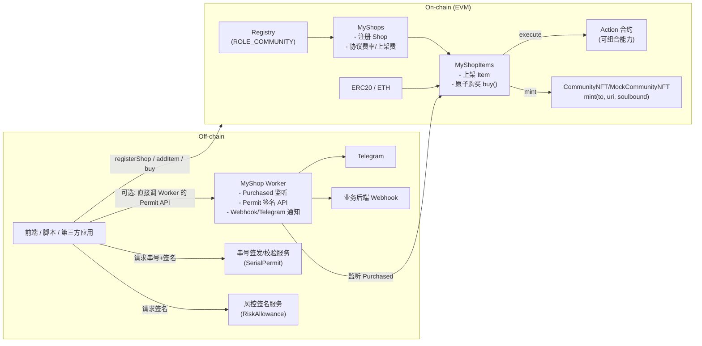
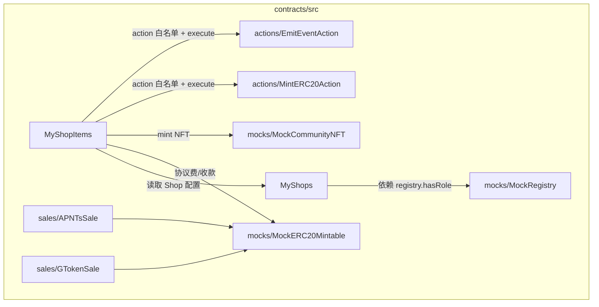

# MyShop

一个“链上协议 + 轻服务”的最小可用电商/门票/权益售卖系统：

- **On-chain**：`MyShops`（店铺注册与协议配置）+ `MyShopItems`（上架与原子购买 `buy()`）
- **Worker**：Purchased 监听、Permit 签名 API（SerialPermit / RiskAllowance）、Query API（shops/items/purchases + 内存索引）
- **Frontend**：广场 / 买家入口 / 店主后台 / 协议后台 + 诊断页

常用入口：

- 里程碑与任务：[docs/milestones.md](docs/milestones.md)
- 可执行用例清单：[docs/test_cases.md](docs/test_cases.md)
- Worker 使用说明（含 /metrics 与 /indexer）：[docs/worker.md](docs/worker.md)

## 系统架构图



## 分模块架构图（合约）



## 流转关系（关键流程）

### 1) 上架 addItem：默认风控 + 可选风险签名放宽上限


### 2) 购买 buy：串号签名（Mode A）+ 原子收款/分润/NFT/Action


## 文档

- 架构与流程说明：[docs/architecture.md](docs/architecture.md)
- 五步走规划与进度：[Solution.md](Solution.md)
- 里程碑与任务（从 Demo 到可上线）：[docs/milestones.md](docs/milestones.md)
- 可执行测试用例清单（E2E）：[docs/test_cases.md](docs/test_cases.md)
- Shop 管理模块设计：[docs/shop_management.md](docs/shop_management.md)
- Worker（监听/签名/通知）使用说明：[docs/worker.md](docs/worker.md)
- 本地一键演示：[docs/demo_local.md](docs/demo_local.md)
- 前端最小闭环：[frontend/README.md](frontend/README.md)
- Worker 快速说明：[worker/README.md](worker/README.md)
- 合约开发（Foundry）：[contracts/README.md](contracts/README.md)
- Demo 脚本入口：[scripts/demo_local.sh](scripts/demo_local.sh)
- Reference（对齐用）：[reference/](reference/)

## 回归与测试（统一入口）

```bash
# 合约 build + test
./build-test-contracts.sh

# Worker 冒烟（不含前端）
./smoke.sh

# 本地一键回归（含前端 E2E）
./flow-test.sh
```

## 功能列表（feat）

- **Shop**
  - 社区注册 Shop（依赖 `Registry.hasRole(ROLE_COMMUNITY)`）
  - Shop 更新与暂停（owner/协议治理权限）
- **Item（上架/管理）**
  - ShopOwner 上架商品（listing fee 可配置）
  - 默认风控：单店默认最多 5 个 item；可用 `RiskAllowance` 签名放宽上限
  - Item 上下架（active 开关）
  - Action 白名单：协议治理者 允许/禁止可执行的 action 合约
- **购买（原子闭环）**
  - `buy()` 原子完成：收款 + 协议费分润 + mint NFT + execute action
  - 可选串号校验：`requiresSerial=true` 时必须提供 `SerialPermit`（EIP-712 + nonce + deadline）
- **售卖合约（独立模块）**
  - aPNTsSale / GTokenSale：支持 cap/limits、可暂停、事件上报
- **Off-chain Worker**
  - Purchased 事件监听与 payload enrich（补充 item/shop 链上信息）
  - Webhook 转发（可选）与 Telegram 通知（可选）
  - Permit 服务：`/serial-permit` 与 `/risk-allowance`
  - Query API：`/shops` `/items` `/purchases` + 内存索引（可配置 `source=index|chain`）

### Worker 三大功能（带全流程示例）

Worker 的主要作用可以归成 3 类（对应你现在这套“链上协议 + 轻服务”架构）：

- 购买事件监听与通知（Watcher）：持续监听 Purchased 等链上事件，把原始 event 补全成可读 payload（例如解析 item/shop、金额、serialHash 等），然后按需触发 Webhook/Telegram，方便“成交通知/落库/后续发货或权益发放”。
- 签名/Permit 服务（Permit Server）：为链上可验证的 off-chain 逻辑提供 EIP-712 签名（例如 SerialPermit、RiskAllowance），把“串号发放/风控放行”等逻辑从合约里抽出来，但仍保持链上校验与可追溯。
- 查询 API + 轻索引（Query API/Indexer）：提供 /shops /items /purchases 这类聚合读取接口；可用内存索引加速查询，同时保留链上读取回退路径，给前端/SDK 一个稳定的数据入口。

1. Purchased 监听（watch）

- 目标：持续监听 `MyShopItems.Purchased` 事件，并把链上基础字段 + enrich 后的 shop/item 一起输出到 stdout / Webhook / Telegram。
- 代码入口：[watchPurchased.js](file:///Users/jason/Dev/crypto-projects/MyShop/worker/src/watchPurchased.js)

示例输出（关键字段）：

```json
{
  "chainId": 31337,
  "txHash": "0x...",
  "blockNumber": 123,
  "itemId": "1",
  "shopId": "1",
  "buyer": "0x...",
  "recipient": "0x...",
  "quantity": "1",
  "payToken": "0x...",
  "payAmount": "1000",
  "platformFeeAmount": "30",
  "serialHash": "0x...",
  "firstTokenId": "1",
  "item": {
    "tokenURI": "ipfs://...",
    "action": "0x...",
    "requiresSerial": true,
    "active": true
  },
  "shop": { "owner": "0x...", "treasury": "0x...", "paused": false }
}
```

2. Permit 签名 API（permit）

- 目标：给前端/第三方应用提供 EIP-712 签名，链上可验证，避免在前端持有签名私钥。
- 代码入口：[permitServer.js](file:///Users/jason/Dev/crypto-projects/MyShop/worker/src/permitServer.js)

串号签名（SerialPermit → extraData，供 `buy()` 直接传入）：

```bash
curl "http://localhost:8787/serial-permit?buyer=0xBuyer&itemId=1&serial=SERIAL-001&deadline=1730000000"
```

返回：

- `serialHash, nonce, signature, extraData`（extraData 为 ABI 编码后的 bytes）

风险放宽签名（RiskAllowance，供 `addItem()` 在超过默认上架阈值时传入）：

```bash
curl "http://localhost:8787/risk-allowance?shopOwner=0xShopOwner&maxItems=10&deadline=1730000000"
```

3. Query API + 内存索引（api）

- 目标：给广场/列表页提供快速查询：shops/items/purchases；优先走内存索引（快），必要时回退链上读取（全）。
- 代码入口：[apiServer.js](file:///Users/jason/Dev/crypto-projects/MyShop/worker/src/apiServer.js)

示例：

```bash
curl "http://localhost:8788/shops?cursor=1&limit=20"
curl "http://localhost:8788/items?cursor=1&limit=50"
curl "http://localhost:8788/purchases?itemId=1&limit=20&include=enrich"
```

前端对接（Plaza/Buyer/后台）：

- [main.js](file:///Users/jason/Dev/crypto-projects/MyShop/frontend/src/main.js) 支持两个 URL：
  - `WORKER_URL`：Permit（/serial-permit, /risk-allowance）
  - `WORKER_API_URL`：Query（/shops, /items, /purchases），失败时自动回退链上读取
- **一键演示 & 最小前端**
  - 一条命令本地部署 + 购买 + 输出 Purchased payload（可选附带 Query API 校验）
  - Vite 最小前端：直连合约完成 registerShop / addItem / buy（可选对接 Worker）
