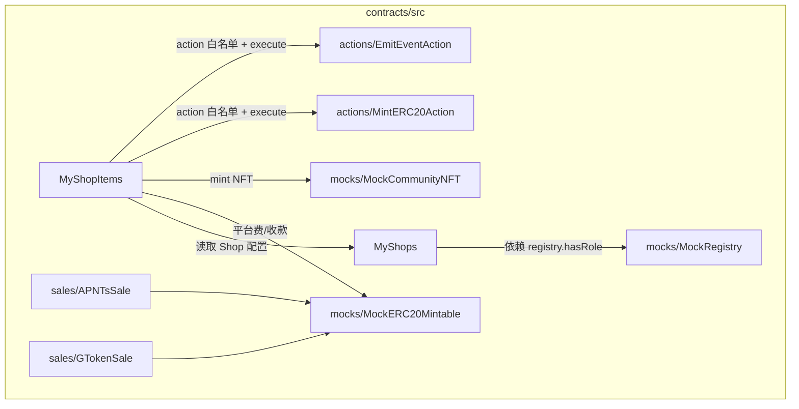
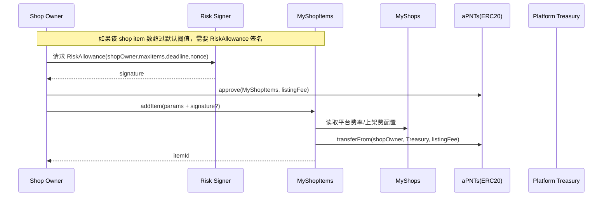
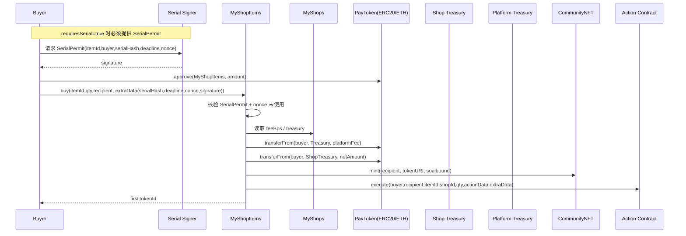

# MyShop

## 系统架构图

## 分模块架构图（合约）

## 流转关系（关键流程）

### 1) 上架 addItem：默认风控 + 可选风险签名放宽上限

### 2) 购买 buy：串号签名（Mode A）+ 原子收款/分润/NFT/Action

## 文档

- 架构与流程说明：[docs/architecture.md](file:///Users/jason/Dev/crypto-projects/MyShop/docs/architecture.md)
- Worker（监听/签名/通知）使用说明：[docs/worker.md](file:///Users/jason/Dev/crypto-projects/MyShop/docs/worker.md)
