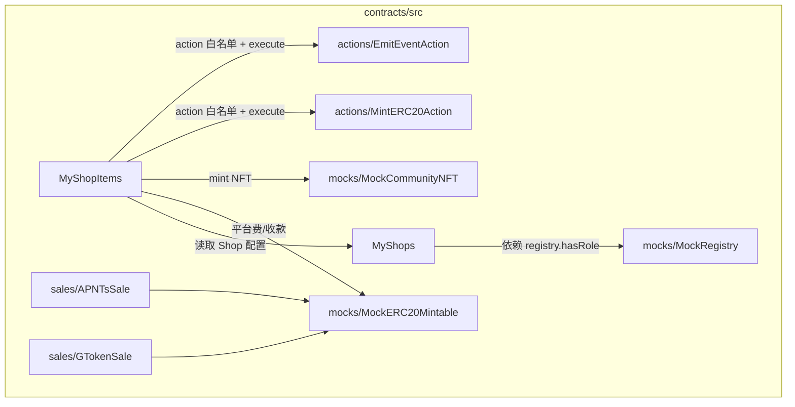
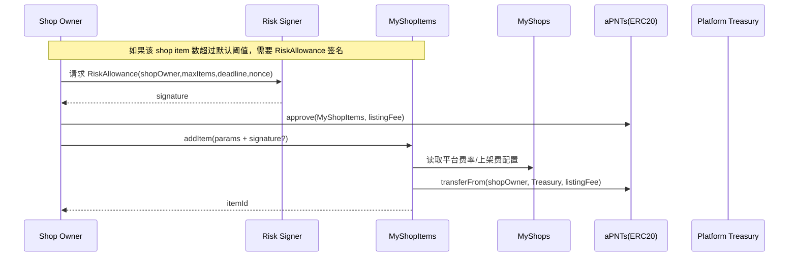
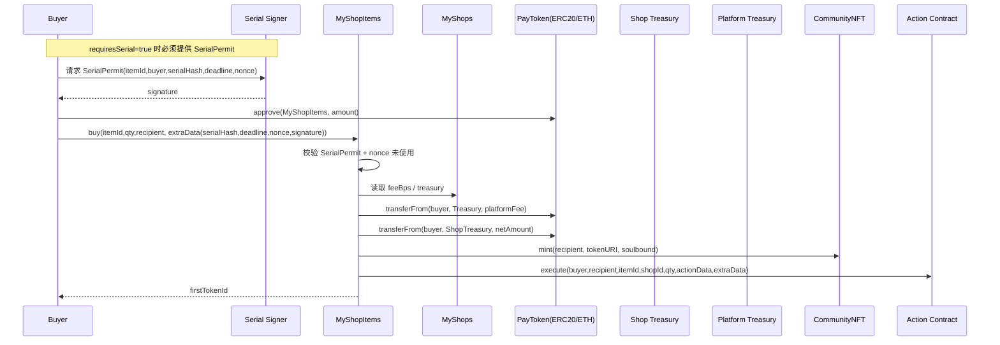

# MyShop

## 系统架构图

## 分模块架构图（合约）

## 流转关系（关键流程）

### 1) 上架 addItem：默认风控 + 可选风险签名放宽上限

### 2) 购买 buy：串号签名（Mode A）+ 原子收款/分润/NFT/Action

## 文档

- 架构与流程说明：[docs/architecture.md](docs/architecture.md)
- 五步走规划与进度：[Solution.md](Solution.md)
- Shop 管理模块设计：[docs/shop_management.md](docs/shop_management.md)
- Worker（监听/签名/通知）使用说明：[docs/worker.md](docs/worker.md)
- 本地一键演示：[docs/demo_local.md](docs/demo_local.md)
- 前端最小闭环：[frontend/README.md](frontend/README.md)
- Worker 快速说明：[worker/README.md](worker/README.md)
- 合约开发（Foundry）：[contracts/README.md](contracts/README.md)
- Demo 脚本入口：[scripts/demo_local.sh](scripts/demo_local.sh)
- Reference（对齐用）：[reference/](reference/)

## 功能列表（feat）

- **Shop**
  - 社区注册 Shop（依赖 `Registry.hasRole(ROLE_COMMUNITY)`）
  - Shop 更新与暂停（owner/平台 owner 权限）
- **Item（上架/管理）**
  - ShopOwner 上架商品（listing fee 可配置）
  - 默认风控：单店默认最多 5 个 item；可用 `RiskAllowance` 签名放宽上限
  - Item 上下架（active 开关）
  - Action 白名单：平台 owner 允许/禁止可执行的 action 合约
- **购买（原子闭环）**
  - `buy()` 原子完成：收款 + 平台费分润 + mint NFT + execute action
  - 可选串号校验：`requiresSerial=true` 时必须提供 `SerialPermit`（EIP-712 + nonce + deadline）
- **售卖合约（独立模块）**
  - aPNTsSale / GTokenSale：支持 cap/limits、可暂停、事件上报
- **Off-chain Worker**
  - Purchased 事件监听与 payload enrich（补充 item/shop 链上信息）
  - Webhook 转发（可选）与 Telegram 通知（可选）
  - Permit 服务：`/serial-permit` 与 `/risk-allowance`
  - Query API：`/shops` `/items` `/purchases` + 内存索引（可配置 `source=index|chain`）
- **一键演示 & 最小前端**
  - 一条命令本地部署 + 购买 + 输出 Purchased payload（可选附带 Query API 校验）
  - Vite 最小前端：直连合约完成 registerShop / addItem / buy（可选对接 Worker）
